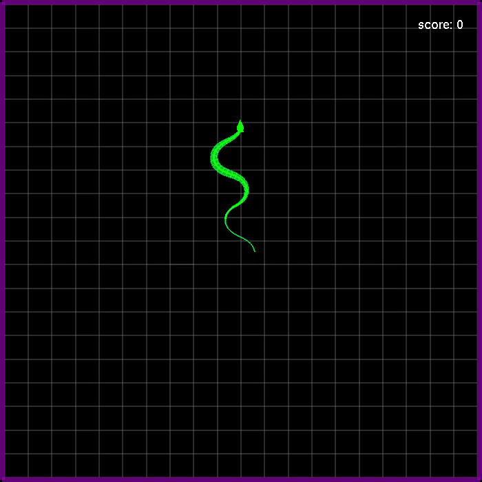

# Snake-Game-With-Realistic-Snake-Gaits

Simple Snake game using OpenGL C++, including a discrete snake robot model for producing real snakelike movements.



## Controls

- UpArrow = Snake Direction Forward.
- LeftArrow = Snake Direction Left.
- RightArrow = Snake Direction Right.
- LeftMouseClick = Pause/Play.

## Dependencies

- [GLUT (OpenGL Utility Toolkit)](http://www.codebind.com/linux-tutorials/install-opengl-ubuntu-linux/)

## Building/Running on Unix (Linux, Ubuntu, Mac OS X, etc.)

- clone the game repository

```
$ git clone https://github.com/YogeshPhalak/Snake-Game-With-Realistic-Snake-Gaits.git
```

- Navigate to the downloaded main.cpp file

```
$ cd Snake-Game
```

- Run this command to build the game:

```
$ g++ main.cpp Env.cpp -o SnakeGame.out -lglut -lGLU -lGL -lgraph
```

- Run this command to run the game:

```
$ ./SnakeGame.out
```

## Using Precompiled Executable for ubuntu 16.04 64 bit

- download ```SnakeGame.out``` form ```Precompiled Executable/```
- Run the following commands

```
$ chmod +x SnakeGame.out
$ ldd SnakeGame.out
```

- Run this command to run the game:

```
$ ./SnakeGame.out
```

# Enjoy !!
